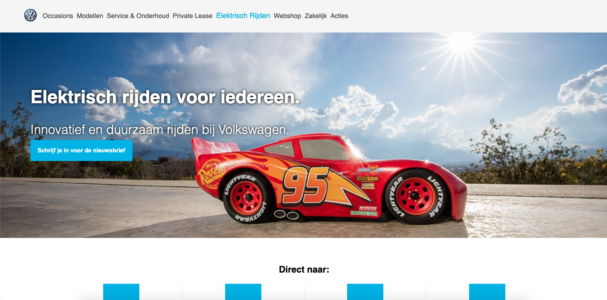

# Project 2 | Volkswagen .nl

  

## Recommended changes for a faster and more accessible volkswagen.nl

In a weeks time I built a prototype to reflect and support dome of the changes/improvements I made to the volkswagen.nl site. The changes I reccomend are based on improving performace (making the website faster) and accessibility. In this readme I'll be explaining the changes i made and the impact each had.

--- tabbing/ focus styles  
--- Accessibility without javascript - server side rendering  
--- Serve images in next-gen formats  
--- Consider lazy-loading  
--- Consider reducing the time spent parsing, compiling, and executing JS. You may find delivering smaller JS payloads helps.  
--- Render content server side instead through client  

## Accessibility at Volkswagen.nl   

The site for Volkswagen worked fine although it was slightly outdated and had a few opportunities for improvement.   
As far as accessibility the site didn't do too bad and offered decent keyboard navigation and compatibility with screenreaders. Only a handful of times did it offer a bad experience by not being descriptive with links, bad contrast between fore- and background, placing text within an image and breaking on tablet devices.  
I tackled these issues by writing semanticly correct html that was also screenreader-friendly, adding missing focus styles, changing the contrast between certain elements and splitting text from images. Now the site is a lot more accesible with only a small number of changes.  Very easy and quick to implement.  

## Performance at Volkswagen.nl   

Next I checked how well the site did performance wise and looked for ways to improve.  
What I found was that the site was loading a huge number of files and seemingly merged many javascript files to one another creating a huge 14500+ lines sized javascript file. I don't know what it did (but my guess is that a lot of it is analytics and third party scripts because I can't imagine there's thousands of lines of code needed for a simple site as this one), but in my revised version it doesn't do any of that any more. Meaning it's lighter and faster now. Previously the site would refuse to display certain content if/when javascript was disabled, I've learnt this is bad behaviour and have made it possible to render all content without.  
The CSS file is also a lot smaller now seeing as I removed a lot of the styling that wasn't being used. Another big change I made was installing a service worker, which cahces certain pages and elements of the site in the clients' cache, making the website available even offline (when the client doesn't have access to WiFi). Furthermore I minified the CSS and JavaScript to make it even lighter.  

### Should have

I also found that the images being served weren'talways suitable and were slightly outdated so volkswagen (or the developers at Valtech) might want to look into serving images in next-gen formats.  

### Feature wishlist

I would have liked to have data about the site's visitors so I could have recommended more suitable solutions and/or improvements.

